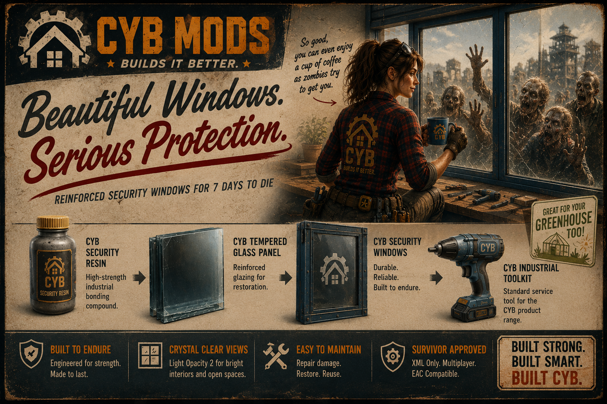

> Reinforced architectural security windows for **7 Days to Die v3.0 (Build 259)**.

---

# Overview

CYB Security Glass extends the vanilla building system with a complete framework of reinforced architectural security windows designed for both practical defence and modern construction.

Built entirely using vanilla XML, the mod introduces a realistic manufacturing chain, specialised construction materials and a dedicated maintenance toolkit while preserving the familiar gameplay and balance of the original game.

Version 1 focuses on delivering a lightweight, balanced and fully integrated experience without replacing existing vanilla mechanics.

---

# Features

## Manufacturing

Produce specialised construction components through a dedicated production chain.

- CYB Security Resin
- CYB Tempered Glass Panel
- CYB Security Window
- CYB Industrial Toolkit

---

## Security Window Framework

The included Shape Controller framework provides a comprehensive collection of reinforced architectural window shapes based on vanilla designs.

Every window shares the same gameplay behaviour, including:

- Standardised durability
- Multi-stage damage system
- Resin-based repairs
- Glass restoration
- Consistent harvesting behaviour
- Seamless Shape Menu integration

### Natural Light

CYB Security Windows are designed to maximise natural light while maintaining reinforced protection, making them ideal for:

- Modern homes
- Greenhouses
- Workshops
- Industrial facilities
- Commercial buildings

---

# Window Lifecycle

CYB Security Windows follow a realistic maintenance cycle.

```text
Manufacture
      │
      ▼

Install
      │
      ▼

Repair Damage
(CYB Security Resin)

      │
      ▼

Glass Shatters
      │
      ▼

Repair Frame
(CYB Security Resin)

      │
      ▼

Restore Glass
(CYB Tempered Glass Panel)
```

---

# CYB Industrial Toolkit

The CYB Industrial Toolkit serves as the dedicated installation and maintenance tool for CYB construction products.

It is used to:

- Install CYB Security Windows
- Repair CYB Security Windows
- Restore broken windows
- Upgrade compatible CYB products
- Support future CYB construction systems

## Vanilla Repair Behaviour

The Industrial Toolkit uses the vanilla **Repair** action provided by *7 Days to Die*.

As a result, it is capable of repairing any repairable vanilla block. This behaviour is part of the game's repair system and cannot currently be restricted through XML while maintaining full EAC compatibility.

Upgrade functionality, however, is intentionally restricted to compatible CYB products, ensuring the toolkit remains the dedicated installation and upgrade tool for the CYB ecosystem.

---

# Installation

Extract the downloaded archive into your **Mods** folder.

```text
7 Days To Die
└── Mods
    └── CYB-Security-Glass
```

Restart the game.

No additional dependencies are required.

---

# Compatibility

- 7 Days to Die v3.0 (Build 259)
- XML-only implementation
- Multiplayer compatible
- EAC compatible
- No Harmony
- No custom DLLs

---

# Included Content

## Components

- CYB Security Resin
- CYB Tempered Glass Panel

## Building

- CYB Security Window Shape Controller
- Reinforced architectural window collection

## Tools

- CYB Industrial Toolkit

---

# Current Release

**Version 1.0.0**

Version 1 delivers the complete manufacturing, installation, maintenance and restoration workflow for CYB Security Windows.

This release is considered feature complete for Version 1.

Future CYB products will continue expanding the manufacturing ecosystem while remaining fully compatible with the existing toolkit.

---

# Support

If you discover a bug or have a suggestion for improving the project, please open an issue on the GitHub repository.

Constructive feedback is always welcome.

---

# Acknowledgements

Developed as part of the **CYB Mods** collection.

Special thanks to **The Fun Pimps** for creating *7 Days to Die*, and to the wider modding community whose shared knowledge, experimentation and collaboration continue to make projects like this possible.

---

Beautiful Windows.
Serious Protection.

VERSION 1.0.0